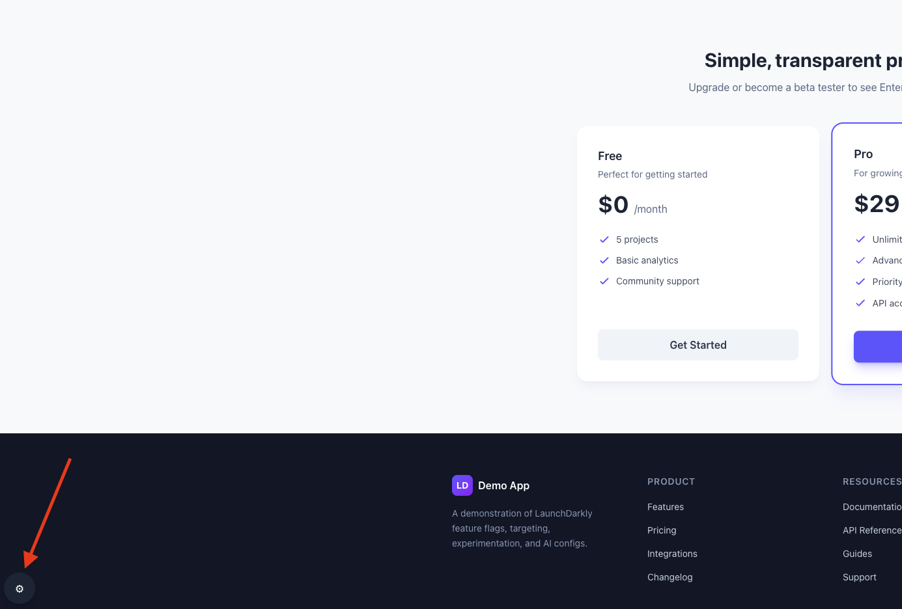
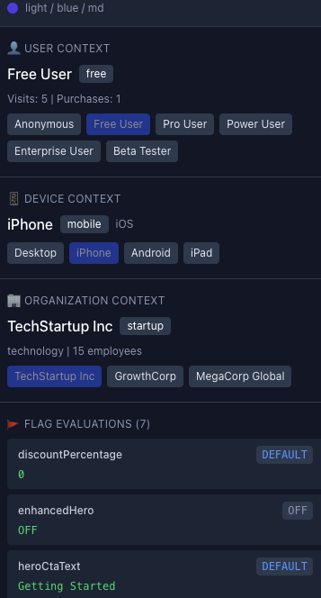

# Demo Runbook

Step-by-step guide for demonstrating LaunchDarkly features.

> **First-time setup?** Complete the [README](../README.md) setup first, then return here.

---

## Start the Demo

```bash
# Terminal 1: Start the app
pnpm dev

# Terminal 2: Keep open for CLI commands
```

Open http://localhost:3000 in browser.

---

## DevPanel Overview

The DevPanel lets you simulate different users, devices, and organizations without real authentication. **Open it before starting the demo.**

<table>
  <tr>
    <td></td>
    <td></td>
  </tr>
  <tr>
    <td><em>Click gear icon (bottom-left)</em></td>
    <td><em>Panel shows contexts + flag values</em></td>
  </tr>
</table>

**Sections:**

| Section              | Purpose                                | Options                                                   |
| -------------------- | -------------------------------------- | --------------------------------------------------------- |
| User Context         | Simulate different users               | Anonymous, Free, Pro, Power User, Enterprise, Beta Tester |
| Organization Context | Test org-based targeting               | TechStartup, GrowthCorp, MegaCorp                         |
| Device Context       | Simulate mobile/desktop/tablet         | Desktop, iPhone, Android, iPad                            |
| Flag Evaluations     | See current flag values + reason codes | Shows why each flag has its value                         |

---

## 0. Reset All Flags

Verify environment and reset all flags to OFF:

```bash
# Verify environment is configured
pnpm cli preflight

# Reset ALL flags to OFF (skips flags already off)
pnpm cli flags toggle --all --off

# Verify all OFF
pnpm cli flags list
```

---

## Part 1: Release & Remediate

**Goal:** Demonstrate instant feature toggle without deploy or page reload.

### Steps

1. **Observe current state**

    - Browser: Standard hero visible (simple styling)
    - DevPanel: `enhancedHero` shows `OFF`

2. **Release the feature**

    ```bash
    pnpm cli flags toggle enhanced-hero --on
    ```

    - Browser: Hero changes **instantly** (gradient background, enhanced styling)
    - No page reload needed!

3. **Rollback the feature**

    ```bash
    pnpm cli flags toggle enhanced-hero --off
    ```

    - Browser: Reverts **instantly** (no reload needed)
    - DevPanel: `enhancedHero` shows `OFF` again

---

## Part 2: Targeting

**Goal:** Show context-based feature targeting with user, device, and organization attributes.

### Steps

1. **Enable targeting flag**

    ```bash
    pnpm cli flags toggle show-enterprise-tier --on
    ```

2. **Demonstrate user targeting**

    - In DevPanel, click **"Anonymous"** or **"Free User"** → Pricing shows 2 tiers (Free, Pro)
    - Click **"Beta Tester"** → Enterprise tier appears!
    - DevPanel: `showEnterpriseTier` shows `TARGET` or `RULE` reason
    - Click **"Free User"** → Enterprise tier disappears

3. **Demonstrate prerequisite** (if configured)

    ```bash
    pnpm cli flags toggle enhanced-hero --off
    ```

    - Even with `show-enterprise-tier` ON, enterprise tier disappears
    - DevPanel: `showEnterpriseTier` shows `PREREQ` reason
    - Turn `enhanced-hero` back ON → enterprise tier returns

4. **Demonstrate multi-context targeting** (optional)

    - Switch to **"MegaCorp"** organization → if segment rule configured, enterprise tier shows
    - Switch to **"iPhone"** device → if `mobile-optimized-checkout` has device rule, banner appears

5. **See the rules** (LD Console)
    - Open `show-enterprise-tier` flag in LD dashboard
    - Show prerequisite: `enhanced-hero` must be ON
    - Show targeting rule: `user.betaTester is true` → serve `true`

---

## Part 3: Experimentation

**Goal:** Show A/B testing with event tracking.

### Steps

1. **Enable experiment flag**

    ```bash
    pnpm cli flags toggle hero-cta-text --on
    ```

2. **Show variations**

    - Switch between users in DevPanel
    - CTA button text changes: "Get Started", "Try Free", or "Start Now"

3. **Demonstrate tracking**

    - Click the CTA button
    - Open browser DevTools → Network tab
    - Show event being sent to LaunchDarkly

4. **Show metrics** (LD Console)
    - Open Experiments in LD dashboard
    - Show `hero-cta-test` experiment
    - Point out: conversion tracking, statistical analysis

---

## Part 4: AI Configs

**Goal:** Demonstrate dynamic AI behavior without code deploy.

### Steps

1. **Enable chatbot**

    ```bash
    pnpm cli flags toggle landing-chatbot --on
    ```

    - Chat bubble appears in bottom-right corner

2. **Test the chatbot**

    - Click chat bubble
    - Send: "What is this demo about?"
    - Receive AI response

3. **Show AI config** (LD Console)

    - Open `landing-chatbot-config` in LD dashboard
    - Show: model selection, system prompt

4. **Live prompt change** (optional)
    - In LD dashboard, modify the system prompt
    - Send new message → response reflects new behavior

---

## Part 5: Webhooks

**Goal:** Show event-driven architecture with flag change notifications.

### Setup

1. **Start ngrok tunnel** (requires `NGROK_DOMAIN` in .env)

    ```bash
    # Terminal 3
    pnpm ngrok
    ```

2. **Configure webhook in LaunchDarkly**

    - Go to LD Console → **Integrations** → **Webhooks** → **Add integration**
    - URL: `https://your-domain.ngrok-free.app/ld-webhook`
    - Select events to listen for (e.g., flag changes)
    - Save the integration

### Steps

1. **Toggle a flag**

    ```bash
    pnpm cli flags toggle enhanced-hero
    ```

2. **Show webhook event** in Terminal 1 (API server logs):

    ```
    ============================================================
    [timestamp] LaunchDarkly Webhook Event
    ============================================================
    Action: updateOn
    Resource: proj/default:env/test:flag/enhanced-hero
    Changed by: your@email.com
    ============================================================
    ```

3. **Use cases**
    - Audit logging
    - Trigger downstream systems
    - Sync with external tools
    - Alert on critical flag changes

---

## Part 6: Additional Flag Types (Optional)

**Goal:** Demonstrate number and JSON flag types.

### Number Flag: Discount Percentage

```bash
pnpm cli flags toggle discount-percentage --on
```

- Pricing table shows discount banner
- Change variation in LD console (0, 10, 15, 25) to show different discounts
- Prices update in real-time

### JSON Flag: Theme Config

```bash
pnpm cli flags toggle theme-config --on
```

- Hero section styling changes based on JSON variation
- Variations: light/blue, dark/purple, light/green
- Change variation in LD console to demonstrate dynamic theming

### Device Targeting: Mobile Checkout

```bash
pnpm cli flags toggle mobile-optimized-checkout --on
```

- In DevPanel, switch to iPhone or Android device
- Mobile checkout banner appears at bottom
- Switch to Desktop - banner disappears

---

## Reference

### Flag Summary

| Part | Flag                        | Type    | What It Shows                    |
| ---- | --------------------------- | ------- | -------------------------------- |
| 1    | `enhanced-hero`             | Boolean | Instant toggle, SSE updates      |
| 2    | `show-enterprise-tier`      | Boolean | Context targeting, prerequisites |
| 3    | `hero-cta-text`             | String  | A/B testing, event tracking      |
| 4    | `landing-chatbot`           | Boolean | AI config, dynamic prompts       |
| 5    | —                           | —       | Webhooks, event-driven           |
| 6    | `discount-percentage`       | Number  | Dynamic pricing variations       |
| 6    | `theme-config`              | JSON    | Multi-value flags, theming       |
| 6    | `mobile-optimized-checkout` | Boolean | Device-based targeting           |

### Evaluation Reasons

The DevPanel shows WHY each flag evaluated to its value:

| Reason    | Meaning                                     |
| --------- | ------------------------------------------- |
| `OFF`     | Flag is turned off                          |
| `DEFAULT` | Fell through to default rule                |
| `TARGET`  | Matched individual user targeting           |
| `RULE`    | Matched a targeting rule (shows rule index) |
| `PREREQ`  | Prerequisite flag not satisfied             |

### CLI Commands

```bash
# Environment
pnpm cli preflight                        # Validate env setup

# Flags
pnpm cli flags list                       # All flags with state
pnpm cli flags show <key>                 # Flag details + variations
pnpm cli flags toggle <key> [--on|--off]  # Toggle single flag
pnpm cli flags toggle --all --off         # Turn all flags OFF
pnpm cli flags toggle --all --on          # Turn all flags ON

# Resources
pnpm cli experiments list                 # List experiments
pnpm cli experiments show <key>           # Experiment details
pnpm cli metrics list                     # List metrics
pnpm cli metrics show <key>               # Metric details
pnpm cli ai list                          # List AI configs
pnpm cli ai show <key>                    # AI config details
```

---

## Reset

```bash
pnpm cli flags toggle --all --off
```
